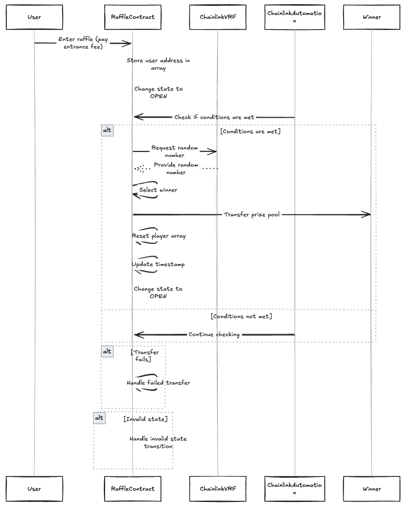

# Decentralized Raffle Smart Contract

A provably fair, decentralized raffle system built on Ethereum using Chainlink VRF for verifiable randomness.

## Overview

This smart contract implements a lottery system where:

- Players can enter by paying an entrance fee
- After a set time interval, a random winner is selected using Chainlink VRF
- The winner receives the entire prize pool
- The system is fully automated using Chainlink Automation

## System Architecture



## Key Features

- Verifiable random number generation via Chainlink VRF
- Automated winner selection using Chainlink Automation
- Configurable entrance fee and time interval
- Support for multiple networks (Sepolia testnet and local development)
- Comprehensive test coverage
- Gas-optimized operations

## Getting Started

### Prerequisites

- Foundry
- Node.js
- Chainlink subscription (for VRF)

### Installation

1. Clone the repository

```bash
git clone <repository-url>
cd raffle-contract
```

2. Install dependencies

```bash
forge install
```

3. Set up environment variables

```bash
cp .env.example .env
# Add your API keys and private keys
```

### Deployment

1. Deploy to local network

```bash
forge script script/DeployRaffle.s.sol --rpc-url local
```

2. Deploy to Sepolia testnet

```bash
forge script script/DeployRaffle.s.sol --rpc-url sepolia
```

## Contract Structure

### Core Components

- `Raffle.sol`: Main contract implementing the raffle logic
- `HelperConfig.s.sol`: Network configuration management
- `Interactions.s.sol`: VRF subscription management
- `RaffleTest.t.sol`: Comprehensive test suite

### Key Functions

- `enterRaffle()`: Enter the raffle by paying the entrance fee
- `checkUpkeep()`: Check if it's time to select a winner
- `performUpkeep()`: Trigger the winner selection process
- `fulfillRandomWords()`: Callback function for receiving random number

## Testing

Run the test suite:

```bash
forge test
```

Run with verbosity:

```bash
forge test -vvv
```

## Contract address

[RaffleContract](https://sepolia.etherscan.io/address/0xBf0332915F6f85D49877eDf2cE7CbDDE84d6E9dd)

## License

MIT
